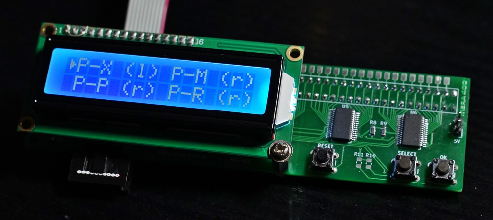

WS-400 is a device that connects to any of MERA-400 debug interfaces to display internal CPU and AWP states. You can see it in action [here](https://www.youtube.com/watch?v=3XAOpLWKt_o)

After powering the device on, user selects the debug interface which WS-400 is connected to with *SELECT* button. Available connections are:

* **CPU**: P-X (l), P-M (r), P-P (r), P-R (r), P-A (l),
* **AWP**: FPA (l) FPA (r), FPM (l), FPM (r), FPS (l).

Connector location (either left or right) is denoted in parentheses. Selection is confirmed with *OK* button and WS-400 immediately starts displaying active signals. If all active signals don't fit on the screen, right pointing arrow appears on the bottom right. *SELECT* button can then be used to switch to next portion of active signals.

User can also switch to raw display mode at any time with *OK* button. In this mode *SELECT* button allows switching between 16-bit portions of the interface view.

Device can also be installed on the interface rotated 180 degrees in Z axis. This requires translation of signal, which is achieved by powering on or resetting the device with button *OK* pressed.

